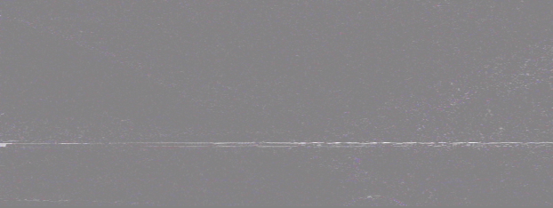

# video-scanner
Contains tools for scanning video files for information in conjunction with Avisynth workflows.

## Initial setup

Create and activate a Python virtual environment.  For example, on Windows from the Command Prompt:

```
<path_to>\python.exe -m venv .\.venv
.\Scripts\activate.bat
```

Next, install the requirements:

```
pip install -r requirements.txt
```

Note that you must also ensure that FFmpeg is in your PATH, if it is not already.

You can now run the scripts in this repository.

## top_line_errors

This tool is intended for use with identifying occasional bad frames that have severe errors within a single horizontal line.  For example, this could be a severe VHS dropout that spans several lines.

The usage of this tool is best illustrated with an example.  Suppose that a video contains a single frame with an artifact like this:


The [SpotLess](https://forum.doom9.org/showthread.php?t=181777) Avisynth filter can work reasonably well to remove this artifact.  However, it will also remove detail from other parts of the frame as well.  This implies that frames with no defects will also be impacted.

We can use this tool in conjunction with Avisynth to only apply the SpotLess filter to frames that actually need it.  Other frames will be passed through unmodified.

First, you must output each field in an interlaced video into their own respective videos.  This is inspired by [this post](https://forum.doom9.org/showthread.php?p=1932874#post1932874) on Doom9.  The following Avisynth fragment can help accomplish this:

```
# Always crop the borders to remove any errors that regularly occur there, such as from head switching noise.
Crop(10, 4, -10, -8)

# Process even frames:
original = SeparateFields.SelectEven
# Example filter for removing the artifacts
filtered = original.SpotLess(tm=false, ThSAD=2000)
# "difference" will call abs on the difference, unlike the Subtract filter.
diff = Overlay(original, filtered, mode="difference")
diff
# Uncomment this for debugging.  Note that this stacked debug output is not compatible with top_line_errors:
# StackVertical(original, filtered, diff)

# <NOT SHOWN: Repeat the above process using SelectOdd>
```

The rendered output will contain the difference between the input frame and the filtered/denoised frame.  Render this output to a LOSSLESS video file supported by FFmpeg.  For example, FFV1 in an mkv container works well.



Next, run the top_line_errors script to analyze each output video that you rendered:

```
# NOTE: the script provides default values for many parameters
python top_line_errors.py diff_even.mkv > bad_frames_even.txt
```

The script works as follows for each frame:

1.  The frame is converted to RGB if it is not already.
2.  All pixel channels are averaged into a single value.
3.  All pixel values for each horizontal line are averaged.
4.  At this point, we have a simple one-dimensional list of average pixel error for each line.  This list is sorted in descending order.  (If you'd like to see this intermediate list, look into the `--debug-frame` argument.)
5.  The top-most erroneous lines are chosen, as specified by `--top-n`.  The error values for each of these lines are then averaged together into a single error value for the entire frame.

This results in a simple list of a single error value for each frame.  These are then filtered using the `--frame-threshold` parameter.

The output contains a list of frames that exceed the `--frame-threshold` frame error:

```
# Bad frame numbers for use with Avisynth ConditionalReader
TYPE bool
DEFAULT false

# frame 469 error: 176.0795238095238
469 true

# frame 1776 error: 163.54142857142858
1776 true
```

At this point, you can uncomment the `StackVertical` line in the original Avisynth script.  Examine each frame number and ensure it's a bad frame you want to apply filtering to.  If you don't want to apply filtering (e.g. it's not a bad frame), then delete the frame number entirely from the output.  You might also use this as an opportunity to tune the parameters to your filter (e.g. SpotLess), and then optionally repeat this entire process.

The resulting text files can be used with the [ConditionalReader](http://avisynth.nl/index.php/ConditionalReader) and [ConditionalFilter](http://avisynth.nl/index.php/ConditionalFilter) filters in Avisynth to apply filtering to only the bad frames when generating a final output:

```
function fix_bad_frames(clip original, string badFrameFile) {
    filtered = original.SpotLess(tm=false, ThSAD=2000)
    ConditionalFilter(original, filtered, original, "bad_frame", "==", "True", true).ConditionalReader(badFrameFile, "bad_frame", true)
}

even = SeparateFields.SelectEven.fix_bad_frames("bad_frames_even.txt")
odd = SeparateFields.SelectOdd.fix_bad_frames("bad_frames_odd.txt")
Interleave(even, odd).Weave
```

## dv_merge

Experimental tool for merging raw DV video files.  This is a simple tool with some key input requirements:

- The files must be of the same length (same exact file size).
- Corresponding frames must have the same frame number / byte offset in every input file.

Based on these requirements, the tool can be more resilient to DV timecode errors that might challenge an alternative algorithm that tries to match corresponding frames using DV timecodes.  Instead, it simply assumes that corresponding frames are at the same position.  The output file is guaranteed to have the exact same frame count as all the input files.

The tool has two merge algorithms that can be specified with the `--merge-algorithm` argument:

- `analysis`: Runs both DV Analyzer and DVRescue analysis tools against the inputs.  The output frame is chosen from an input that has no analysis errors from either tool, if possible.  If only one tool reported an issue, preference is given to clean DVRescue results.
- `binary`: A very simplistic n-way binary merge of the inputs.  The most common byte at each byte position is selected in the output.  This will result in the output raw frame data being a blend of the inputs.  Note that since I don't have a copy of the DV specifications, it's unclear how safe this really is.  It's possible it could result in something that other decoders might struggle with.
